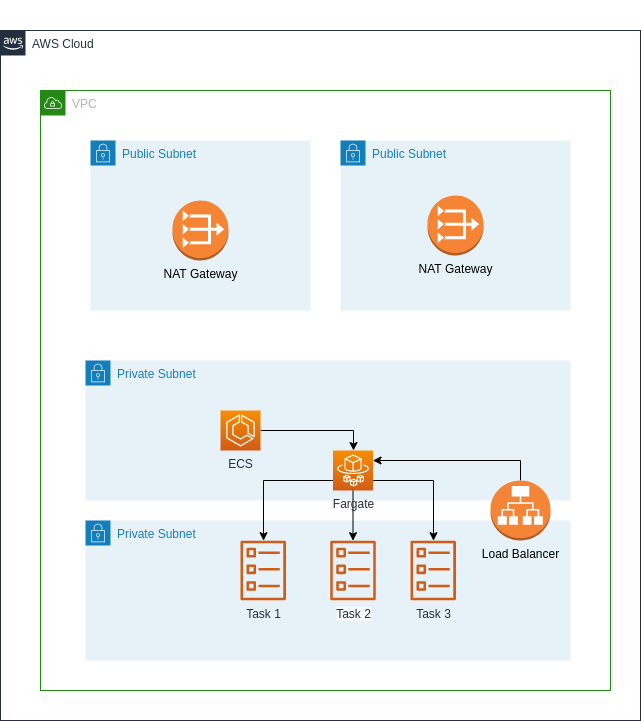

# Drover DevOps challenge
Application in ECS cluster using Terraform modules

## Getting started

These instructions will get you a copy of the deployment process created by Jorge Martins in order to make a successful deployment.

## Repository areas

### Diagrams

Contains the xml file with the diagram created in draw.io and the png generated from it:




### Drover App

In the beginning I created a simple API using Quarkus described as the Drover App.
I didn't know if it was required to obtain the Docker app from the AWS ECR service so that's why I didn't added that solution in a script to push the *Dockerfile* created to an ECR repository, and then point it to a task in ECS.

### Terraform

So I separated the solution in two modules:

#### Network

The Network module contains all the network infrastructure that can be reused in future modules. Contains multiple resources such as:

* VPC
* Private Subnets
* Public Subnets
* Internet Gateway
* Route Tables
* Route Tables associations
* Elastic IP
* NAT Gateways

#### Drover App

The Drover App module contains all the Drover App related infrastructure. It will run an Nginx server as the Docker application. Contains multiple resources such as:

* ECS Service
* ECS Task definitions
* Load Balancer
* Security Groups
* IAM Roles
* CloudWatch Log Group and Stream
* Auto scaling


### Jenkinsfile

The *Jenkinsfile* was used in a Jenkins local server to test this Terraform modules in a CI/CD solution

## Deployment Guide

### Requirements

1. AWS CLI - [Install AWS CLI in Linux](https://docs.aws.amazon.com/cli/latest/userguide/install-linux.html)

The contents of *.aws/* directory must have this configuration:
Configuration file - *.aws/config*

```bash
[default]
region = eu-west-2
```

Credentials file - *.aws/credentials*

```bash
[default]
aws_access_key_id = access_id
aws_secret_access_key = access_key
```

2. Terraform- [Install Terraform in Linux](https://learn.hashicorp.com/tutorials/terraform/install-cli)

### Usage

To make a successful deployment the following commands must be executed:

```bash
cd terraform
terraform init
terraform plan
terraform apply -auto-approve
```

After this deployment the output generated will have an URL pointing the Load Balancer created which contains an Nginx Server running.

To remove the deployment resources from AWS the following commands must be executed:

```bash
terraform destroy
```
